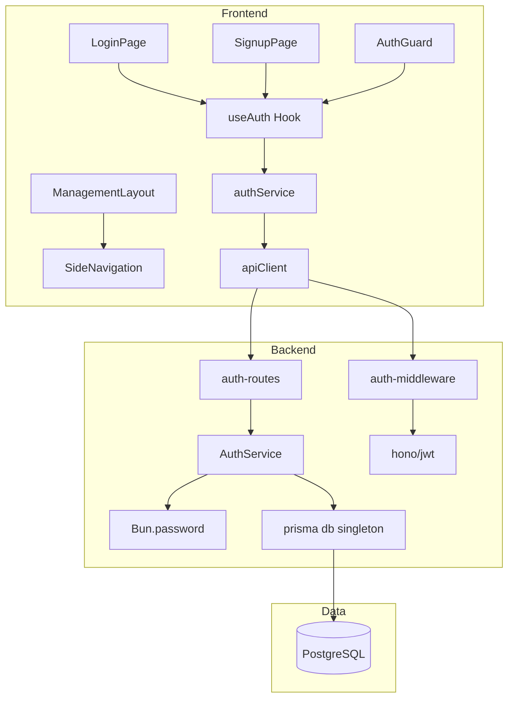
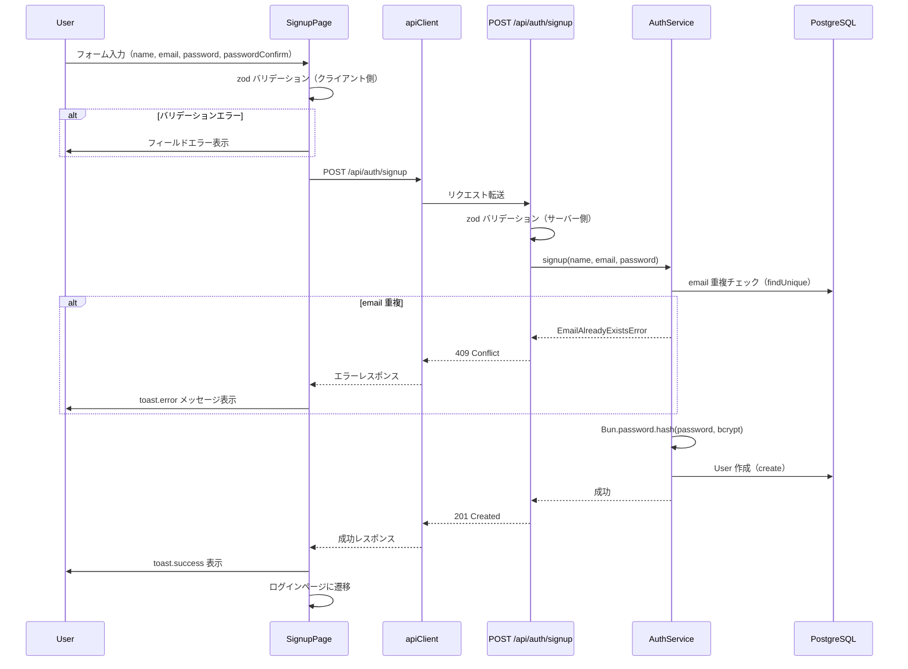
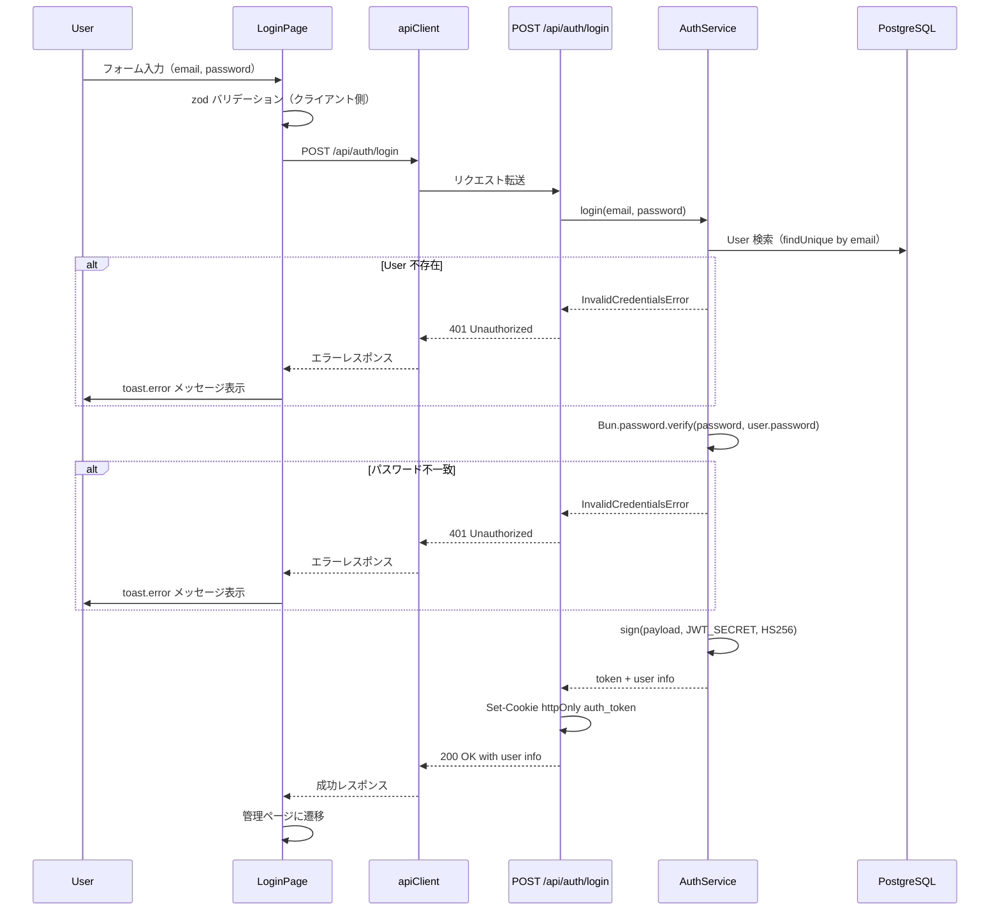
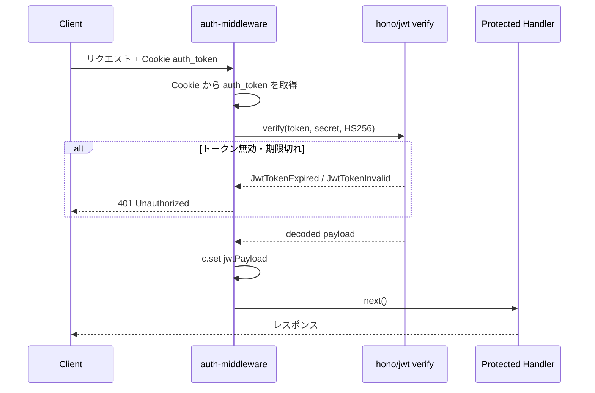

# Technical Design: auth-foundation

## Overview

**Purpose**: 本機能は、メールアドレスとパスワードによるユーザー認証基盤を提供する。サインアップ、ログイン、ログアウト、および JWT トークンベースのアクセス制御を実現し、人材管理システムの全機能の前提となるセキュリティ基盤を構築する。

**Users**: 人事担当者および管理者が、認証を経てシステムの人材管理機能にアクセスするために利用する。

**Impact**: 現在未認証でアクセス可能な状態のアプリケーションに対し、認証レイヤーを追加する。ログイン後はサイドナビゲーション付きの管理ページレイアウトに遷移し、以降のすべての機能（部署管理、従業員CRUD等）はこの認証基盤の上に構築される。

### Goals
- JWT ベースのステートレス認証フローを実装し、サインアップ・ログイン・ログアウトを提供する
- パスワードのセキュアなハッシュ化（bcrypt）と、バリデーションルール（8文字以上、英字・数字・記号混在）を適用する
- 未認証ユーザーのルート保護（フロントエンド・バックエンド両方）を実現する
- サイドナビゲーション付き管理ページレイアウトを構築し、認証状態に応じたUIを提供する

### Non-Goals
- ロールベースアクセス制御（RBAC）は本スコープに含まない
- リフレッシュトークンによるトークン更新フローは Post-MVP で検討
- OAuth / ソーシャルログインは対象外
- パスワードリセット・メール確認フローは対象外
- リフレッシュトークンのローテーション機構は Post-MVP で検討

## Architecture

### Existing Architecture Analysis

現在のシステムは以下の構成で動作している。

- **バックエンド**: Hono サーバー (`backend/src/index.ts`) に CORS と Logger ミドルウェアが適用済み。ルーティングはヘルスチェックのみ
- **フロントエンド**: React + Vite SPA (`frontend/src/App.tsx`) に react-router-dom でルーティング設定済み。`BrowserRouter` と `QueryClientProvider` は `main.tsx` で提供済み
- **データモデル**: Prisma スキーマに `User` モデル（id, name, email, password, createdAt, updatedAt）が定義済み。email に UNIQUE 制約あり
- **API クライアント**: `frontend/src/lib/api-client.ts` にフェッチラッパーが存在。Content-Type ヘッダーの自動設定と、非 OK レスポンスの Error スローを実装済み
- **開発プロキシ**: Vite の `/api` プロキシで `localhost:3000` に転送。同一オリジン動作

### Architecture Pattern & Boundary Map



**Architecture Integration**:
- **Selected pattern**: レイヤードアーキテクチャ。Routes（HTTP層）-> Service（ビジネスロジック層）-> Data（永続化層）の3層構成
- **Domain/feature boundaries**: 認証機能を `features/auth/` ディレクトリ（フロントエンド）と `routes/`, `services/`, `middleware/` の各ディレクトリ（バックエンド）に分離
- **Existing patterns preserved**: Hono ミドルウェアチェーン、Prisma ORM アクセス、apiClient ラッパー、react-router-dom ルーティング
- **New components rationale**: AuthGuard（ルート保護）、ManagementLayout（サイドナビレイアウト）、auth-middleware（API保護）は認証要件の充足に必須
- **Steering compliance**: TypeScript strict モード、zod スキーマファースト、関心の分離、コロケーション原則を遵守

### Technology Stack

| Layer | Choice / Version | Role in Feature | Notes |
|-------|------------------|-----------------|-------|
| Frontend | React ^19.0.0 + Vite ^6.3.0 | 認証UI（ログイン・サインアップページ）、ルート保護 | 既存 |
| Frontend | react-router-dom ^7.5.0 | 認証ガード、ページ遷移制御 | 既存 |
| Frontend | react-hook-form ^7.55.0 + zod ^3.24.0 | フォームバリデーション（ログイン・サインアップ） | 既存 |
| Frontend | TanStack Query ^5.70.0 | 認証API通信のキャッシュ・ローディング管理 | 既存 |
| Frontend | sonner (latest) | トースト通知（成功・エラーメッセージ） | **新規追加** |
| Backend | Hono ^4.7.0 | 認証ルーティング、JWT ミドルウェア | 既存。`hono/jwt` ビルトインを使用 |
| Backend | Bun.password | パスワードハッシュ化（bcrypt） | ランタイムビルトイン、追加依存なし |
| Data | Prisma ^7.0.0 + PostgreSQL | User モデルの永続化 | 既存。スキーマ変更なし |
| Infrastructure | Bun runtime | サーバー実行、パスワードハッシュワーカー | 既存 |

## System Flows

### サインアップフロー



### ログインフロー



### 認証ミドルウェアフロー



**Key Decisions**:
- JWT トークンは httpOnly Cookie で管理。XSS によるトークン窃取を防止し、セキュリティを強化
- クライアント・サーバー双方でバリデーションを実行し、一貫性を確保
- email/password の認証失敗時は「メールアドレスまたはパスワードが正しくありません」と統一メッセージを返し、攻撃者への情報漏洩を防止
- トークン有効期限は 24 時間に設定（MVP 段階での利便性とセキュリティのバランス）
- フロントエンドに service 層（`authService`）を設け、API呼び出しロジックをコンポーネントから分離
- PrismaClient はシングルトンパターンで共通化し、バックエンド全体で再利用

## Requirements Traceability

| Requirement | Summary | Components | Interfaces | Flows |
|-------------|---------|------------|------------|-------|
| 1.1 | サインアップフォーム表示 | SignupPage, SignupForm | -- | サインアップフロー |
| 1.2 | 有効情報でのアカウント作成・成功通知 | SignupForm, AuthService, auth-routes | POST /api/auth/signup | サインアップフロー |
| 1.3 | メールアドレス形式バリデーション | signupSchema (zod) | -- | サインアップフロー |
| 1.4 | パスワード8文字以上バリデーション | signupSchema (zod) | -- | サインアップフロー |
| 1.5 | パスワード文字種バリデーション | signupSchema (zod) | -- | サインアップフロー |
| 1.6 | パスワード確認一致バリデーション | signupSchema (zod) | -- | サインアップフロー |
| 1.7 | 必須項目未入力バリデーション | signupSchema (zod) | -- | サインアップフロー |
| 1.8 | メールアドレス重複チェック | AuthService | POST /api/auth/signup | サインアップフロー |
| 1.9 | アカウント作成成功通知 | SignupPage (toast) | -- | サインアップフロー |
| 1.10 | アカウント作成失敗通知 | SignupPage (toast) | -- | サインアップフロー |
| 1.11 | ログインページへの遷移リンク | SignupPage | -- | -- |
| 1.12 | パスワードハッシュ化保存 | AuthService (Bun.password) | -- | サインアップフロー |
| 2.1 | ログインフォーム表示 | LoginPage, LoginForm | -- | ログインフロー |
| 2.2 | 認証成功・トークン発行・管理ページ遷移 | LoginForm, AuthService, useAuth | POST /api/auth/login | ログインフロー |
| 2.3 | メールアドレス未入力バリデーション | loginSchema (zod) | -- | ログインフロー |
| 2.4 | パスワード未入力バリデーション | loginSchema (zod) | -- | ログインフロー |
| 2.5 | 認証失敗エラーメッセージ | LoginPage (toast), AuthService | POST /api/auth/login | ログインフロー |
| 2.6 | トークンのCookie保存 | auth-routes (Set-Cookie httpOnly) | POST /api/auth/login | ログインフロー |
| 2.7 | サインアップページへの遷移リンク | LoginPage | -- | -- |
| 3.1 | ログアウトボタン表示 | SideNavigation | -- | -- |
| 3.2 | ログアウト処理（トークン削除・遷移） | SideNavigation, useAuth | -- | -- |
| 3.3 | ログアウト後のアクセス拒否 | AuthGuard, auth-middleware | -- | 認証ミドルウェアフロー |
| 4.1 | 未認証ユーザーのリダイレクト | AuthGuard | -- | -- |
| 4.2 | 未認証APIリクエストの401返却 | auth-middleware | -- | 認証ミドルウェアフロー |
| 4.3 | 公開ページのアクセス許可 | AuthGuard, auth-middleware | -- | -- |
| 4.4 | トークン有効期限切れ時のリダイレクト | useAuth, apiClient | -- | 認証ミドルウェアフロー |
| 4.5 | ログインユーザーのメールアドレス表示 | SideNavigation, useAuth | -- | -- |
| 4.6 | 認証済みユーザーの公開ページリダイレクト | GuestGuard | -- | -- |
| 5.1 | サインアップサーバーエラー通知 | SignupPage (toast) | -- | サインアップフロー |
| 5.2 | ログインサーバーエラー通知 | LoginPage (toast) | -- | ログインフロー |
| 5.3 | ログアウトエラー時のフォールバック | SideNavigation, useAuth | -- | -- |
| 5.4 | 送信中のローディング状態 | LoginForm, SignupForm | -- | -- |

## Components and Interfaces

| Component | Domain/Layer | Intent | Req Coverage | Key Dependencies (P0/P1) | Contracts |
|-----------|--------------|--------|--------------|--------------------------|-----------|
| signupSchema | Shared/Validation | サインアップフォームの入力バリデーションスキーマ | 1.3, 1.4, 1.5, 1.6, 1.7 | zod (P0) | State |
| loginSchema | Shared/Validation | ログインフォームの入力バリデーションスキーマ | 2.3, 2.4 | zod (P0) | State |
| AuthService | Backend/Service | 認証ビジネスロジック（サインアップ・ログイン・トークン発行） | 1.2, 1.8, 1.12, 2.2, 2.5 | Bun.password (P0), hono/jwt (P0), PrismaClient (P0) | Service |
| auth-routes | Backend/Route | 認証API エンドポイント定義 | 1.2, 2.2 | AuthService (P0), zod (P0) | API |
| auth-middleware | Backend/Middleware | JWT トークン検証ミドルウェア | 3.3, 4.2, 4.3 | hono/jwt (P0) | Service |
| useAuth | Frontend/Hook | 認証状態管理（ユーザー情報・認証状態） | 2.2, 3.2, 4.4, 4.5 | authService (P0) | State |
| authService | Frontend/Service | 認証API呼び出し層（signup, login, logout, me） | 2.2, 2.6, 3.2 | apiClient (P0) | Service |
| prisma (singleton) | Backend/Lib | PrismaClient シングルトンインスタンス | -- | @prisma/client (P0) | Service |
| AuthGuard | Frontend/Component | 認証済みユーザーのみアクセス可能なルートガード | 4.1, 4.3 | useAuth (P0), react-router-dom (P0) | -- |
| GuestGuard | Frontend/Component | 未認証ユーザーのみアクセス可能なルートガード | 4.6 | useAuth (P0), react-router-dom (P0) | -- |
| LoginPage | Frontend/Page | ログインページ | 2.1, 2.7 | LoginForm (P0), useAuth (P0) | -- |
| SignupPage | Frontend/Page | サインアップページ | 1.1, 1.11 | SignupForm (P0), useAuth (P1) | -- |
| LoginForm | Frontend/Feature | ログインフォームUI | 2.1, 2.3, 2.4, 2.5, 5.2, 5.4 | react-hook-form (P0), loginSchema (P0) | -- |
| SignupForm | Frontend/Feature | サインアップフォームUI | 1.1, 1.3-1.10, 5.1, 5.4 | react-hook-form (P0), signupSchema (P0) | -- |
| ManagementLayout | Frontend/Layout | サイドナビゲーション付き管理ページレイアウト | 3.1, 4.5 | SideNavigation (P0), useAuth (P0) | -- |
| SideNavigation | Frontend/Component | サイドナビゲーション（ログアウトボタン、ユーザー情報） | 3.1, 3.2, 4.5, 5.3 | useAuth (P0) | -- |
| apiClient (拡張) | Frontend/Lib | 認証ヘッダー自動付与・401レスポンス処理 | 2.6, 4.2, 4.4 | useAuth (P1) | Service |

### Shared / Validation

#### signupSchema

| Field | Detail |
|-------|--------|
| Intent | サインアップフォームの入力値に対するバリデーションルールを zod スキーマとして定義する |
| Requirements | 1.3, 1.4, 1.5, 1.6, 1.7 |

**Responsibilities & Constraints**
- フロントエンド（react-hook-form 連携）とバックエンド（リクエスト検証）の両方で使用可能なバリデーションスキーマ
- パスワード確認フィールドの一致検証を `.refine()` で実装
- バリデーションメッセージは日本語で定義

**Contracts**: State [x]

##### State Management
```typescript
import { z } from "zod";

const passwordRegex = /^(?=.*[a-zA-Z])(?=.*\d)(?=.*[!@#$%^&*()_+\-=\[\]{};':"\\|,.<>\/?`~])/;

const signupSchema = z
  .object({
    name: z
      .string()
      .min(1, "ユーザー名を入力してください"),
    email: z
      .string()
      .min(1, "メールアドレスを入力してください")
      .email("有効なメールアドレスを入力してください"),
    password: z
      .string()
      .min(1, "パスワードを入力してください")
      .min(8, "パスワードは8文字以上で入力してください")
      .regex(
        passwordRegex,
        "パスワードは半角英字・数字・記号をそれぞれ1文字以上含めてください"
      ),
    passwordConfirm: z
      .string()
      .min(1, "パスワード（確認）を入力してください"),
  })
  .refine((data) => data.password === data.passwordConfirm, {
    message: "パスワードが一致しません",
    path: ["passwordConfirm"],
  });

type SignupInput = z.infer<typeof signupSchema>;
```

**Implementation Notes**
- バックエンドでは `passwordConfirm` を除いた部分スキーマ（`signupRequestSchema`）を使用してリクエストボディを検証する。サーバー側でパスワード確認の一致検証は不要（クライアント側で実施済み）
- `backend/src/validators/` に配置し、フロントエンドからは同一ロジックの zod スキーマを `frontend/src/features/auth/` に配置

#### loginSchema

| Field | Detail |
|-------|--------|
| Intent | ログインフォームの入力値に対するバリデーションルールを zod スキーマとして定義する |
| Requirements | 2.3, 2.4 |

**Responsibilities & Constraints**
- 必須項目チェックのみのシンプルなスキーマ

**Contracts**: State [x]

##### State Management
```typescript
import { z } from "zod";

const loginSchema = z.object({
  email: z
    .string()
    .min(1, "メールアドレスを入力してください"),
  password: z
    .string()
    .min(1, "パスワードを入力してください"),
});

type LoginInput = z.infer<typeof loginSchema>;
```

### Backend / Service

#### AuthService

| Field | Detail |
|-------|--------|
| Intent | 認証に関するビジネスロジック（ユーザー作成、認証情報検証、JWT トークン発行）を提供する |
| Requirements | 1.2, 1.8, 1.12, 2.2, 2.5 |

**Responsibilities & Constraints**
- パスワードハッシュ化: `Bun.password.hash()` で bcrypt アルゴリズムを使用
- パスワード検証: `Bun.password.verify()` でハッシュとの一致を確認
- JWT 発行: `hono/jwt` の `sign()` で HS256 アルゴリズムを使用。ペイロードに `sub`（ユーザーID）、`email`、`exp`（有効期限24時間）を含む
- メールアドレス重複チェック: Prisma の `findUnique` で既存ユーザーを検索
- 認証失敗時のエラーメッセージは統一（email/password どちらが間違っているかを明かさない）

**Dependencies**
- External: `Bun.password` -- パスワードハッシュ化・検証 (P0)
- External: `hono/jwt` sign -- JWT トークン生成 (P0)
- Outbound: PrismaClient -- User テーブルへのアクセス (P0)

**Contracts**: Service [x]

##### Service Interface
```typescript
interface AuthServiceResult<T> {
  success: true;
  data: T;
}

interface AuthServiceError {
  success: false;
  error: {
    code: "EMAIL_ALREADY_EXISTS" | "INVALID_CREDENTIALS" | "INTERNAL_ERROR";
    message: string;
  };
}

type AuthResult<T> = AuthServiceResult<T> | AuthServiceError;

interface SignupResponse {
  id: string;
  name: string;
  email: string;
}

interface LoginResponse {
  token: string;
  user: {
    id: string;
    name: string;
    email: string;
  };
}

interface AuthService {
  signup(input: {
    name: string;
    email: string;
    password: string;
  }): Promise<AuthResult<SignupResponse>>;

  login(input: {
    email: string;
    password: string;
  }): Promise<AuthResult<LoginResponse>>;
}
```

- Preconditions: 入力値はルート層で zod バリデーション済み
- Postconditions: signup 成功時、パスワードは bcrypt ハッシュ化されて保存。login 成功時、有効期限付き JWT トークンが返却される
- Invariants: 平文パスワードはログ出力・レスポンス返却しない

**Implementation Notes**
- Integration: `backend/src/services/auth-service.ts` に配置。PrismaClient はファイルスコープでインスタンス化
- Validation: 入力値はルート層（auth-routes）で事前検証されるため、サービス層ではビジネスルールの検証に集中
- Risks: JWT_SECRET が未設定の場合のフォールバック処理が必要。起動時にチェックすることを推奨

### Backend / Route

#### auth-routes

| Field | Detail |
|-------|--------|
| Intent | 認証関連の HTTP エンドポイント（サインアップ・ログイン）を定義し、リクエスト検証とレスポンス整形を行う |
| Requirements | 1.2, 2.2 |

**Responsibilities & Constraints**
- リクエストボディの zod バリデーション
- AuthService へのデリゲーション
- HTTP ステータスコードとレスポンスボディの整形
- エラーレスポンスの統一フォーマット

**Dependencies**
- Inbound: apiClient (Frontend) -- HTTP リクエスト (P0)
- Outbound: AuthService -- ビジネスロジック (P0)
- External: zod -- リクエスト検証 (P0)

**Contracts**: API [x]

##### API Contract

| Method | Endpoint | Request | Response | Errors |
|--------|----------|---------|----------|--------|
| POST | /api/auth/signup | `{ name: string, email: string, password: string }` | `201 { id, name, email }` | 400 (validation), 409 (email duplicate), 500 (server) |
| POST | /api/auth/login | `{ email: string, password: string }` | `200 { user: { id, name, email } }` + Set-Cookie httpOnly | 400 (validation), 401 (invalid credentials), 500 (server) |
| POST | /api/auth/logout | -- | `200 { message }` + Clear-Cookie | 500 (server) |
| GET | /api/auth/me | -- (Cookie auth_token) | `200 { id, name, email }` | 401 (unauthorized) |

**エラーレスポンス統一フォーマット**:
```typescript
interface ApiErrorResponse {
  error: {
    code: string;
    message: string;
  };
}
```

**Implementation Notes**
- Integration: `backend/src/routes/auth-routes.ts` に Hono Router インスタンスとして定義し、`index.ts` で `app.route("/api/auth", authRoutes)` としてマウント
- Validation: リクエストボディを zod スキーマでパースし、失敗時は 400 レスポンスを返却

### Backend / Middleware

#### auth-middleware

| Field | Detail |
|-------|--------|
| Intent | 保護対象 API エンドポイントへのリクエストに対して JWT トークンを検証し、未認証リクエストを拒否する |
| Requirements | 3.3, 4.2, 4.3 |

**Responsibilities & Constraints**
- Cookie（`auth_token`）からJWTトークンを抽出・検証
- 検証成功時、デコード済みペイロードをコンテキストに設定（`c.set("jwtPayload", payload)`）
- `/api/auth/signup` と `/api/auth/login` は認証不要（除外パス）
- トークン期限切れ・無効時は 401 レスポンスを返却

**Dependencies**
- External: `hono/jwt` verify -- トークン検証 (P0)

**Contracts**: Service [x]

##### Service Interface
```typescript
// Hono ミドルウェアとして実装
// auth-middleware は Hono の MiddlewareHandler 型に準拠

interface JwtPayload {
  sub: string;
  email: string;
  exp: number;
  iat: number;
}

// 401 レスポンスフォーマット
interface UnauthorizedResponse {
  error: {
    code: "TOKEN_EXPIRED" | "TOKEN_INVALID" | "TOKEN_MISSING";
    message: string;
  };
}
```

- Preconditions: JWT_SECRET 環境変数が設定されていること
- Postconditions: 認証成功時、`c.get("jwtPayload")` で `JwtPayload` を取得可能
- Invariants: 除外パス（`/api/auth/signup`, `/api/auth/login`）にはミドルウェアを適用しない

**Implementation Notes**
- Integration: `backend/src/middleware/auth-middleware.ts` に配置。`index.ts` で `/api/*` に適用し、auth-routes は除外パスとして設定
- Risks: `hono/jwt` の `verify()` は `JwtTokenExpired` 等のエラー型をスローする。これをキャッチして適切な 401 レスポンスに変換

### Frontend / Hook

#### useAuth

| Field | Detail |
|-------|--------|
| Intent | 認証状態（ユーザー情報）の管理と、認証操作（ログイン・ログアウト）のインターフェースを提供する |
| Requirements | 2.2, 3.2, 4.4, 4.5 |

**Responsibilities & Constraints**
- 認証状態（ユーザー情報・認証済みフラグ）の React Context 提供
- 初期化時に `GET /api/auth/me` でCookieベースの認証状態を確認
- ログイン成功時にユーザー情報をContextに保存
- ログアウト時にContextをクリアしリダイレクト
- JWT トークンは httpOnly Cookie でサーバー管理。フロントエンドはトークンを直接操作しない

**Dependencies**
- Outbound: authService -- API呼び出し (P0)
- External: react-router-dom navigate -- ページ遷移 (P0)

**Contracts**: State [x]

##### State Management
```typescript
interface AuthUser {
  id: string;
  name: string;
  email: string;
}

interface AuthState {
  user: AuthUser | null;
  isAuthenticated: boolean;
  isLoading: boolean;
}

interface AuthContextValue extends AuthState {
  login: (user: AuthUser) => void;
  logout: () => void;
}
```

- State model: React Context + useState で管理。Cookie はサーバー側で管理するため、フロントエンドはユーザー情報のみ保持
- Persistence: ページリロード時は `GET /api/auth/me` でCookieの認証トークンを検証し、ユーザー情報を復元
- Concurrency strategy: React の単一スレッドモデルに依存。状態更新は同期的

**Implementation Notes**
- Integration: `frontend/src/features/auth/useAuth.tsx` に AuthProvider と useAuth フックを定義。AuthProvider は `App.tsx` のルート近くに配置
- Validation: 初期化時に `GET /api/auth/me` を呼び出し、401の場合は未認証状態とする

#### authService (Frontend Service Layer)

| Field | Detail |
|-------|--------|
| Intent | 認証関連のAPI呼び出しをカプセル化し、コンポーネントからAPIの詳細を隠蔽する |
| Requirements | 2.2, 2.6, 3.2 |

**Responsibilities & Constraints**
- サインアップ、ログイン、ログアウト、認証状態確認の各API呼び出しを関数として提供
- apiClient を使用してリクエストを送信
- Cookie は `credentials: "include"` でブラウザが自動送信

**Dependencies**
- Outbound: apiClient -- HTTP通信 (P0)

**Contracts**: Service [x]

##### Service Interface
```typescript
interface AuthService {
  signup(input: { name: string; email: string; password: string }): Promise<SignupSuccessResponse>;
  login(input: { email: string; password: string }): Promise<{ user: AuthUser }>;
  logout(): Promise<void>;
  me(): Promise<AuthUser>;
}
```

**Implementation Notes**
- Integration: `frontend/src/features/auth/auth-service.ts` に配置
- LoginForm / SignupForm から `useMutation` 経由で呼び出す

#### prisma (Backend Singleton)

| Field | Detail |
|-------|--------|
| Intent | PrismaClient のシングルトンインスタンスを提供し、バックエンド全体で接続を共有する |
| Requirements | -- (インフラ基盤) |

**Responsibilities & Constraints**
- PrismaClient を1回だけインスタンス化し、エクスポートする
- 開発時のホットリロードで複数インスタンスが作成されないよう、グローバル変数にキャッシュ

**Contracts**: Service [x]

##### Service Interface
```typescript
// backend/src/lib/prisma.ts
import { PrismaClient } from "../generated/prisma/client";

const globalForPrisma = globalThis as unknown as {
  prisma: PrismaClient | undefined;
};

export const prisma = globalForPrisma.prisma ?? new PrismaClient();

if (process.env.NODE_ENV !== "production") {
  globalForPrisma.prisma = prisma;
}
```

**Implementation Notes**
- Integration: `backend/src/lib/prisma.ts` に配置。AuthService やその他のサービスからインポートして使用

### Frontend / Component

#### AuthGuard

| Field | Detail |
|-------|--------|
| Intent | 認証済みユーザーのみがアクセスできるルートを保護し、未認証ユーザーをログインページにリダイレクトする |
| Requirements | 4.1, 4.3 |

**Responsibilities & Constraints**
- `useAuth` から認証状態を取得し、未認証の場合は `/login` にリダイレクト
- 認証チェック中はローディング表示
- 子コンポーネントを `<Outlet />` で描画

**Dependencies**
- Inbound: react-router-dom Route -- ルート定義 (P0)
- Outbound: useAuth -- 認証状態取得 (P0)

**Implementation Notes**
- Integration: `frontend/src/features/auth/AuthGuard.tsx` に配置。App.tsx のルーティングで `<Route element={<AuthGuard />}>` としてネスト

#### GuestGuard

| Field | Detail |
|-------|--------|
| Intent | 未認証ユーザーのみがアクセスできるルートを定義し、認証済みユーザーを管理ページにリダイレクトする |
| Requirements | 4.6 |

**Responsibilities & Constraints**
- `useAuth` から認証状態を取得し、認証済みの場合は `/` （管理ページ）にリダイレクト
- ログインページ・サインアップページで使用

**Dependencies**
- Outbound: useAuth -- 認証状態取得 (P0)

**Implementation Notes**
- Integration: `frontend/src/features/auth/GuestGuard.tsx` に配置

#### ManagementLayout

| Field | Detail |
|-------|--------|
| Intent | サイドナビゲーション付きの管理ページ共通レイアウトを提供する |
| Requirements | 3.1, 4.5 |

**Responsibilities & Constraints**
- 左側にサイドナビゲーション、右側にメインコンテンツ領域を配置
- `<Outlet />` でネストされたページコンポーネントを描画

**Dependencies**
- Outbound: SideNavigation -- サイドナビゲーション (P0)

**Implementation Notes**
- Integration: `frontend/src/components/ManagementLayout.tsx` に配置。AuthGuard の内側でルーティングに使用

#### SideNavigation

| Field | Detail |
|-------|--------|
| Intent | 管理ページのサイドナビゲーションとして、ナビゲーションリンク・ログインユーザー情報・ログアウトボタンを表示する |
| Requirements | 3.1, 3.2, 4.5, 5.3 |

**Responsibilities & Constraints**
- ログイン中のユーザーのメールアドレスを表示
- ログアウトボタンのクリックでトークン削除・ログインページ遷移
- ログアウト処理中にエラーが発生した場合でも、クライアント側のトークンを削除してログインページに遷移（フォールバック）

**Dependencies**
- Outbound: useAuth -- 認証状態・ログアウト操作 (P0)
- External: lucide-react -- アイコン (P2)

**Implementation Notes**
- Integration: `frontend/src/components/SideNavigation.tsx` に配置
- 将来の機能（部署管理、従業員管理等）のナビゲーションリンクは、後続のスペックで追加

### Frontend / Page

#### LoginPage / SignupPage

LoginPage と SignupPage はプレゼンテーション層のページコンポーネントであり、新しい境界を導入しない。

- **LoginPage** (`frontend/src/pages/LoginPage.tsx`): ログインフォーム（LoginForm）を包含し、サインアップページへの遷移リンクを提供（2.1, 2.7）
- **SignupPage** (`frontend/src/pages/SignupPage.tsx`): サインアップフォーム（SignupForm）を包含し、「ログインに戻る」リンクを提供（1.1, 1.11）

### Frontend / Feature

#### LoginForm / SignupForm

LoginForm と SignupForm は認証フォームの UI とインタラクションを担当する。react-hook-form + zod resolver でバリデーションを実行し、TanStack Query の `useMutation` で API 通信を管理する。

- **LoginForm** (`frontend/src/features/auth/LoginForm.tsx`): loginSchema によるバリデーション、送信中のローディング状態、エラートースト表示（2.1, 2.3, 2.4, 2.5, 5.2, 5.4）
- **SignupForm** (`frontend/src/features/auth/SignupForm.tsx`): signupSchema によるバリデーション（文字種・一致検証含む）、送信中のローディング状態、成功・エラートースト表示（1.1, 1.3-1.10, 5.1, 5.4）

**共通パターン**:
```typescript
// useMutation パターン（LoginForm / SignupForm 共通）
interface AuthFormProps {
  // フォームは自己完結型。外部への依存は useAuth と apiClient のみ
}

// 送信中の状態管理
// - mutation.isPending で送信ボタンの disabled 制御
// - mutation.isPending でローディングインジケータ表示
// - mutation.onSuccess / onError でトースト通知
```

**Implementation Notes**
- Integration: `frontend/src/features/auth/` ディレクトリにコロケーション
- Validation: react-hook-form の `zodResolver` で zod スキーマを直接連携

### Frontend / Lib

#### apiClient（拡張）

| Field | Detail |
|-------|--------|
| Intent | 既存の apiClient を拡張し、Cookie ベースの認証と 401 レスポンスのハンドリングを追加する |
| Requirements | 4.2, 4.4 |

**Responsibilities & Constraints**
- `credentials: "include"` を設定し、Cookie を自動送信
- 401 レスポンス受信時にログインページへのリダイレクトをトリガー
- 既存の apiClient インターフェースとの後方互換性を維持

**Contracts**: Service [x]

##### Service Interface
```typescript
// 既存の apiClient シグネチャを維持しつつ、Cookie 認証を自動処理
async function apiClient<T>(
  endpoint: string,
  options?: RequestInit,
): Promise<T>;

// 内部動作:
// 1. credentials: "include" で Cookie を自動送信
// 2. レスポンスが 401 の場合:
//    - window.location.href = "/login" でリダイレクト
//    - カスタムエラー（AuthenticationError）をスロー
```

**Implementation Notes**
- Integration: 既存の `frontend/src/lib/api-client.ts` を修正。`credentials: "include"` を追加
- Risks: apiClient 内で直接 `window.location.href` を使用すると React のルーティングと衝突する可能性がある。カスタムイベントまたは React Context を介したリダイレクトを検討

## Data Models

### Domain Model

認証基盤に関連するドメインモデルは、既存の `User` エンティティと JWT トークンで構成される。

- **User（既存）**: 認証対象のユーザーエンティティ。name, email（一意制約）, password（bcrypt ハッシュ）を保持
- **JWT トークン（値オブジェクト）**: ステートレスな認証トークン。sub（ユーザーID）、email、exp（有効期限）を含むペイロードで構成

**ビジネスルール & Invariants**:
- email はシステム全体で一意でなければならない（DB レベルの UNIQUE 制約で強制）
- パスワードは平文で保存してはならない（bcrypt ハッシュ化が必須）
- JWT トークンは発行後 24 時間で失効する

### Logical Data Model

**User テーブル（既存 -- 変更なし）**:

| Column | Type | Constraints | Notes |
|--------|------|-------------|-------|
| id | String (cuid) | PK | 自動生成 |
| name | String | NOT NULL | ユーザー名 |
| email | String | UNIQUE, NOT NULL | ログイン識別子 |
| password | String | NOT NULL | bcrypt ハッシュ値 |
| created_at | DateTime | NOT NULL, DEFAULT now() | 作成日時 |
| updated_at | DateTime | NOT NULL, auto-update | 更新日時 |

Prisma スキーマの変更は不要。既存の `User` モデルがそのまま利用可能。

### Data Contracts & Integration

**API Data Transfer**:

サインアップリクエスト:
```typescript
interface SignupRequest {
  name: string;
  email: string;
  password: string;
}
```

サインアップレスポンス (201):
```typescript
interface SignupSuccessResponse {
  id: string;
  name: string;
  email: string;
}
```

ログインリクエスト:
```typescript
interface LoginRequest {
  email: string;
  password: string;
}
```

ログインレスポンス (200) + Set-Cookie httpOnly:
```typescript
interface LoginSuccessResponse {
  user: {
    id: string;
    name: string;
    email: string;
  };
}
// JWT トークンは Set-Cookie ヘッダーで httpOnly Cookie として返却
// Cookie: auth_token=<jwt>; HttpOnly; SameSite=Lax; Path=/; Max-Age=86400
```

エラーレスポンス (4xx/5xx):
```typescript
interface ApiErrorResponse {
  error: {
    code: string;
    message: string;
  };
}
```

## Error Handling

### Error Strategy

認証機能のエラーは、ユーザーエラー（入力不備）、認証エラー（資格情報不一致）、システムエラー（サーバー障害）の3カテゴリに分類する。すべてのエラーは統一フォーマット（`ApiErrorResponse`）でレスポンスし、フロントエンドではトースト通知で表示する。

### Error Categories and Responses

**User Errors (400)**:
- バリデーション失敗 -- zod パースエラーをフィールドレベルのエラーメッセージとして返却。フロントエンドでフォームフィールドに表示
- メールアドレス重複 (409) -- 「このメールアドレスは既に登録されています」

**Authentication Errors (401)**:
- 認証失敗 -- 「メールアドレスまたはパスワードが正しくありません」（email/password どちらの誤りかを明かさない）
- トークン期限切れ -- 「セッションの有効期限が切れました。再度ログインしてください」
- トークン無効 -- 「認証情報が無効です。再度ログインしてください」

**System Errors (500)**:
- サインアップ失敗 -- 「アカウントの作成に失敗しました。再度お試しください」（5.1）
- ログイン失敗 -- 「ログインに失敗しました。再度お試しください」（5.2）
- ログアウト失敗 -- クライアント側トークン削除のフォールバック実行（5.3）

## Testing Strategy

### Unit Tests
- **signupSchema**: パスワードバリデーション（文字数、文字種、一致検証）の正常系・異常系
- **loginSchema**: 必須項目バリデーションの正常系・異常系
- **AuthService.signup**: 正常なユーザー作成、メールアドレス重複時のエラー、パスワードハッシュ化の検証
- **AuthService.login**: 正しい資格情報での認証成功、不正な資格情報でのエラー、JWT トークン生成の検証
- **auth-middleware**: 有効なトークンでの通過、期限切れトークンでの 401、トークン未付与での 401

### Integration Tests
- **POST /api/auth/signup**: 正常なサインアップフロー（201）、重複メールアドレス（409）、バリデーションエラー（400）
- **POST /api/auth/login**: 正常なログインフロー（200 + トークン）、不正な資格情報（401）
- **認証ミドルウェア統合**: 保護エンドポイントへの認証付きリクエスト通過、認証なしリクエストの 401 拒否

### E2E/UI Tests
- **サインアップフロー**: フォーム入力 -> バリデーション -> 成功通知 -> ログインページ遷移
- **ログインフロー**: フォーム入力 -> 認証成功 -> 管理ページ遷移 -> サイドナビゲーション表示
- **ログアウトフロー**: サイドナビゲーションのログアウトボタン -> ログインページ遷移 -> 保護ページアクセス不可
- **ルートガード**: 未認証での管理ページアクセス -> ログインページリダイレクト
- **ゲストガード**: 認証済みでのログインページアクセス -> 管理ページリダイレクト

## Security Considerations

- **パスワードハッシュ化**: `Bun.password.hash()` で bcrypt アルゴリズムを使用。平文パスワードはレスポンス・ログに含めない
- **認証エラーメッセージ**: メールアドレスの存在可否を推測できないよう、認証失敗メッセージを統一
- **JWT シークレット管理**: `JWT_SECRET` は環境変数で管理。`.env` ファイルは `.gitignore` に含める
- **トークン有効期限**: 24 時間で設定。Post-MVP でリフレッシュトークンの導入を検討
- **XSS 対策**: JWT トークンは httpOnly Cookie で管理し、JavaScript からのアクセスを遮断。XSS によるトークン窃取リスクを排除
- **CORS 設定**: 既存の CORS 設定（`origin: "http://localhost:5173"`, `credentials: true`）を維持
